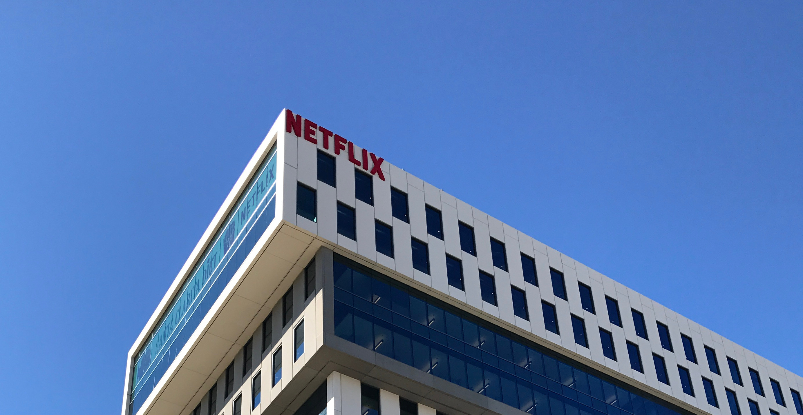

# Drylab PDF - Page 1

## Text

DrylabNews
for investors & friends · May 2017
Welcome to our first newsletter of 2017! It's the 2.05 MNOK loan from Innovation
been a while since the last one, and a lot has Norway. Including the development
happened. We promise to keep them coming agreement with Filmlance International, the
every two months hereafter, and permit total new capital is 5 MNOK, partly tied to
ourselves to make this one rather long. The the successful completion of milestones. All
big news is the beginnings of our launch in formalities associated with this process are
the American market, but there are also now finalized.
interesting updates on sales, development,
New owners:We would especially like to
mentors and (of course) the investment
warmly welcome our new owners to the
round that closed in January.
Drylab family: Unni Jacobsen, Torstein Jahr,
New capital:The investment round was Suzanne Bolstad, Eivind Bergene, Turid Brun,
successful. We raised 2.13 MNOK to match Vigdis Trondsen, Lea Blindheim, Kristine
34 Academy of Motion Picture Arts and Sciences · Alesha & Jamie Metzger · Amazon
AWS · Apple · Caitlin Burns, PGA · Carlos Melcer · Chimney L.A. · Dado Valentic ·
Dave Stump · DIT WIT · ERA NYC · Facebook · Fancy Film · FilmLight · Geo Labelle ·
mmeeeettiinnggss
Google · IBM · Innovation Norway (NYC) · Innovation Norway (SF) · International
NNYY ·· SSFF
Cinematographers Guild · NBC · Local 871 · Netflix · Pomfort · Radiant Images ·
LLAA ·· LLVV
Screening Room · Signiant · Moods of Norway · Tapad · Team Downey

## Images

1. `drylab_page1_image1.jpg` (481.8897999999999x249.30139999999994)

